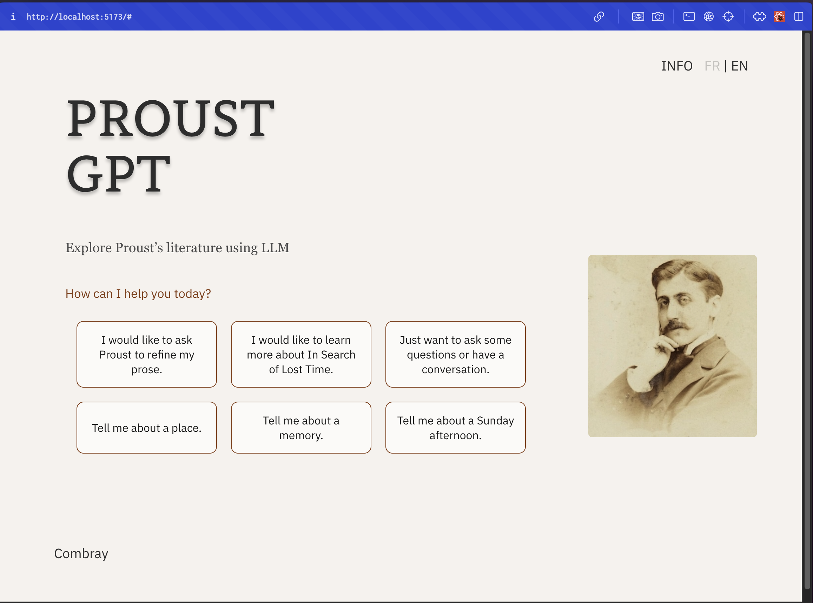

Initial Screen:



# ProustGPT Chat Application

This project is a conversational web app that uses LLaMA (Large Language Model) to interact with users as "ProustGPT," a chatbot inspired by Marcel Proust. It offers three modes: **Q&A**, **Explore In Search of Lost Time**, and **Refine Prose**. The backend is powered by Flask, and the frontend is built using React and Styled Components.

## Features

- **Q&A**: Users can ask questions, and ProustGPT provides responses in a reflective and insightful manner.
- **Explore In Search of Lost Time**: Users can explore relevant passages from Marcel Proust's *In Search of Lost Time*. The chatbot retrieves and displays passages related to the user's query.
- **Refine Prose**: Users can input their own prose, and ProustGPT provides suggestions to refine the writing in the style of Marcel Proust.

## Technologies Used

### Frontend
- **React**: For building the user interface.
- **Styled Components**: For styling the components using CSS-in-JS.

### Backend
- **Flask**: For handling API requests and responses.
- **llama_cpp**: For integrating the LLaMA model for text generation.
- **Sentence Transformers**: For embedding queries and passages and performing similarity searches using RAG (Retrieval-Augmented Generation).

## Installation

### Prerequisites

- Node.js (for running the React frontend)
- Python 3.x (for running the Flask backend)
- A compatible LLaMA model installed locally (e.g., `Meta-Llama-3-8B-Instruct-Q4_K_M.gguf`)
- `pipenv` or `virtualenv` for Python dependency management

### Step 1: Clone the Repository

```bash
git clone https://github.com/your-username/proustgpt.git
cd proustgpt
```

### Step 2: Install Backend Dependencies

```bash
cd backend
pipenv install  # or use virtualenv + pip install
```

Ensure you have the required Python libraries, such as Flask, LLaMA, and Sentence Transformers.

### Step 3: Install Frontend Dependencies

```bash
cd frontend
npm install
```

### Step 4: Running the Backend

```bash
cd backend
pipenv shell  # Activate virtual environment (or activate the virtualenv manually)
flask run
```

The backend should now be running at `http://127.0.0.1:5000`.

### Step 5: Running the Frontend

Open a *different* terminal, and run the following:

```bash
npm start
```

The frontend should now be running at `http://localhost:3000`.

## Usage

Once the backend and frontend are both running, you can open your browser and navigate to `http://localhost:3000`.

You can then choose one of the three modes:

1. **Q&A**: Ask ProustGPT a question about any topic.
2. **Explore In Search of Lost Time**: Enter a query to retrieve relevant passages from *In Search of Lost Time*.
3. **Refine Prose**: Submit your prose for refinement in the style of Marcel Proust.

## API Routes

### `/api/qa` (POST)
- Handles Q&A mode, allowing users to ask questions and get reflective answers.

### `/api/explore_lost_time` (POST)
- For retrieving passages from *In Search of Lost Time* using RAG based on user queries.

### `/api/refine_prose` (POST)
- For refining user-submitted prose in the style of Marcel Proust.

## File Structure

```
├── backend
│   ├── app.py              # Main Flask application
│   ├── parsed.json         # Parsed data from In Search of Lost Time
│   └── requirements.txt    # Python dependencies
├── public
├── src
├── components
│   └── ChatPage.tsx  # Main chat page component
│   └── App.tsx         # Main app entry point
│── package.json        # Node.js dependencies
└── README.md               # Project documentation
```

## Work in Progress

- [ ] Need to complete the 'Combray' page (gallery)
- [ ] Need to add a fine-tuned model for the QA
- [ ] Need to add conversation history feature

## Future Improvements

- Enhance the **Refine Prose** mode to provide more intuitive feedback based on the prose context.
- Add more sophisticated RAG methods for the **Explore In Search of Lost Time** mode.
- Improve LLaMA response quality for longer and more complex queries.

## License

This project is licensed under Apache 2 License.

## Acknowledgments

- **LLaMA** by Meta for the large language model.
- **Sentence Transformers** for providing the powerful embedding models.
- The open-source community for all their valuable tools and contributions.
