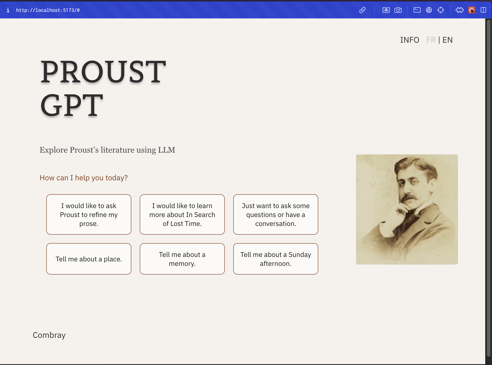
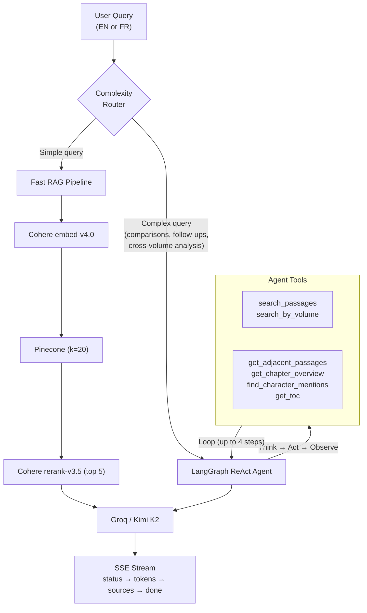
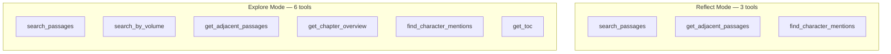

Initial Screen:



# ProustGPT

A full-stack web application combining RAG (Retrieval-Augmented Generation) with agentic multi-step reasoning and introspective AI conversation for exploring Marcel Proust's *In Search of Lost Time* (*A la recherche du temps perdu*) — in both English and French.

**Two modes:**
1. **Explore Lost Time** — An agentic RAG system that retrieves passages, traces character arcs across volumes, and builds multi-step literary analysis — with bilingual support
2. **Reflect on My Day** — Introspective conversation in Proust's style, with optional corpus access when your experience echoes Proust's themes

## Technology Stack

### Frontend
- **React** + **TypeScript** (Vite)
- **Styled Components** with transient props
- **React Router** with split-view layout
- **i18next** for bilingual interface (EN/FR)
- Server-Sent Events (SSE) for streaming responses

### Backend
- **FastAPI** with streaming SSE endpoints
- **LangGraph** for agentic tool orchestration (ReAct agent)
- **Groq API** with Kimi K2 (`moonshotai/kimi-k2-instruct`, 131K context)
- **Cohere** embed-v4.0 (1536-dim multilingual embeddings) + rerank-v3.5
- **Pinecone** serverless vector database
- **spaCy** for entity extraction
- **Docker** support for containerized deployment

## Agentic RAG Architecture

Every query flows through a **complexity router** that decides whether to use fast single-step RAG or a multi-step LangGraph ReAct agent. Simple questions get fast answers; complex queries — comparisons across volumes, character arc tracing, follow-up questions — get multi-step reasoning with tool use.


```mermaid
flowchart TB
    Q["User Query<br/>(EN or FR)"] --> R{"Complexity<br/>Router"}

    R -->|"Simple query"| RAG["Fast RAG Pipeline"]
    R -->|"Complex query<br/>(comparisons, follow-ups,<br/>cross-volume analysis)"| Agent["LangGraph ReAct Agent"]

    RAG --> Embed["Cohere embed-v4.0"]
    Embed --> Pinecone["Pinecone (k=20)"]
    Pinecone --> Rerank["Cohere rerank-v3.5 (top 5)"]
    Rerank --> LLM["Groq / Kimi K2"]

    Agent -->|"Think → Act → Observe"| Tools

    subgraph Tools ["Agent Tools"]
        direction LR
        API["search_passages<br/>search_by_volume"]
        Free["get_adjacent_passages<br/>get_chapter_overview<br/>find_character_mentions<br/>get_toc"]
    end

    Tools -->|"Loop (up to 4 steps)"| Agent
    Agent --> LLM

    LLM --> SSE["SSE Stream<br/>status → tokens → sources → done"]
```

### Complexity Routing

The router examines the query and conversation history to decide the path:

- **Fast RAG** — Single-step retrieval for straightforward questions (faster, cheaper)
- **Agent** — Multi-step reasoning for queries involving comparisons (`compare`, `contrast`, `how does X change`), cross-volume analysis (`across volumes`, `evolution`), narrative sequencing (`what happens next/before`), or follow-up questions that reference prior conversation

### Agent Tools

The Explore agent has access to 6 tools — 4 of which are **free** (no API calls, pure in-memory operations):

| Tool | API Calls | Description |
|------|-----------|-------------|
| `search_passages` | Yes | Semantic search across the full corpus |
| `search_by_volume` | Yes | Volume-filtered semantic search |
| `get_adjacent_passages` | Free | Read surrounding passages for context |
| `get_chapter_overview` | Free | First passages of a chapter |
| `find_character_mentions` | Free | In-memory text search for character names |
| `get_toc` | Free | Full table of contents |

### Two Agent Modes


```mermaid
flowchart LR
    subgraph Explore ["Explore Mode — 6 tools"]
        direction TB
        E1["search_passages"]
        E2["search_by_volume"]
        E3["get_adjacent_passages"]
        E4["get_chapter_overview"]
        E5["find_character_mentions"]
        E6["get_toc"]
    end

    subgraph Reflect ["Reflect Mode — 3 tools"]
        direction TB
        R1["search_passages"]
        R2["get_adjacent_passages"]
        R3["find_character_mentions"]
    end

    Explore ~~~ Reflect
```

- **Explore agent** — All 6 tools, optimized for literary analysis. Will search, cross-reference, and build multi-passage arguments.
- **Reflect agent** — 3 tools, used sparingly. The default mode is pure conversation — the agent only reaches into the corpus when the user's experience genuinely echoes a Proustian theme.

### Streaming Status Events

The frontend shows which tool the agent is using in real-time — e.g., *"Searching for passages about jealousy..."* or *"Reading surrounding passages near #4521..."* — so the user understands what's happening during multi-step reasoning.

### RAG Pipeline Detail

For both fast RAG and agent tool calls, retrieval follows the same core pipeline:

1. **Query** — User asks a question (English or French)
2. **Embed** — Cohere embed-v4.0 (multilingual, 1536-dim)
3. **Retrieve** — Pinecone vector search (k=20 candidates)
4. **Rerank** — Cohere rerank-v3.5 (top 5)
5. **Generate** — Groq API with Kimi K2 (131K context, streaming)

French queries work naturally because Cohere embed-v4.0 is multilingual — a French question finds English-embedded passages that are semantically equivalent. The corresponding French text is stored in Pinecone metadata and returned when `lang=fr`.

## Bilingual Alignment Pipeline

The app serves Proust's text in both English and French. Aligning two translations passage-by-passage is non-trivial because the English and French texts have different paragraph structures — the English comes from Standard Ebooks (Moncrieff translation, vols 1-6) and Project Gutenberg Australia (Hudson translation, vol 7), while the French comes from Wikisource (original Proust text). Translators often split, merge, or restructure paragraphs differently.

### The Problem

A naive approach — aligning paragraphs by their position (paragraph 5 in EN = paragraph 5 in FR) — breaks down when paragraph counts differ. For example, Volume 3 Chapter 1 has 872 EN paragraphs but only 417 FR paragraphs. Proportional position mapping produces systematic drift: by the end of a long chapter, the French text can be pages off from the English. This means users reading the corpus would see French text that doesn't correspond to the English passage beside it.

### The Solution: Sentence-Level Semantic Alignment

We use **Cohere embed-v4.0** (a multilingual embedding model) to semantically match text across languages — but at **sentence** granularity rather than paragraph-level, which dramatically reduces alignment errors:

1. **Split** each chapter into individual sentences using NLTK's `sent_tokenize` — this gives us fine-grained alignment units instead of paragraphs that may have been split or merged differently across translations
2. **Embed** all EN and FR sentences with Cohere embed-v4.0 — the model maps semantically equivalent text in different languages to nearby points in embedding space
3. **Compute** a cosine similarity matrix between all EN and FR sentences within each chapter
4. **Align** using dynamic programming with a monotonicity constraint — EN sentence *i* must map to a FR sentence index >= EN sentence *i-1*'s mapping, preserving reading order while maximizing total semantic similarity
5. **Chunk** the aligned sentence pairs into passages — paragraph-aware chunking (500-1500 chars) that never splits sentences, keeping EN and FR text together

This produces ~12,900 bilingual passage pairs with 99.98% French coverage.

### Pipeline Scripts

Run from the `backend/` directory:

```bash
# 1. Download English corpus (Standard Ebooks vols 1-6, PG Australia vol 7)
python scripts/download_english_corpus.py

# 2. Download French corpus (Wikisource)
python scripts/download_french_corpus.py

# 3. Sentence-level alignment (requires COHERE_API_KEY in .env)
python scripts/align_sentences.py --test   # Test on Vol 1 Overture first
python scripts/align_sentences.py          # Full alignment (~10-15 min)

# 4. Verify alignment quality
python scripts/verify_alignment.py

# 5. Ingest into Pinecone
python scripts/ingest_pinecone.py --index proust-index-v2
```

A proportional position fallback (`align_paragraphs_proportional`) is built into `align_sentences.py` for chapters where the API is unavailable, but produces lower-quality alignment.

## Frontend Features

- **Split-view layout** — Chat panel alongside a ReaderPanel with draggable divider
- **PassageCard** — Carousel display with bilingual toggle, bookmarks, and volume/chapter metadata
- **Citation linking** — `[1]`, `[2]` references in the AI response highlight the corresponding passage in the ReaderPanel
- **Conversation sessions** — Persistent chat history in localStorage with session management
- **Full-text reading** — Browse all 7 volumes with table of contents, paginated chapters, and reading progress tracking
- **i18n** — Full English and French interface via i18next (separate from the bilingual corpus text)

## Setup

### Prerequisites
- **Node.js** (version 18+)
- **Python 3.11+**
- API keys for Pinecone, Groq, and Cohere

### Frontend

```bash
npm install
npm run dev          # Start dev server at localhost:5173
npm run build        # Production build
```

### Backend

```bash
cd backend
python3 -m venv venv && source venv/bin/activate
pip install -r requirements.txt
python -m spacy download en_core_web_sm
cp .env.example .env
# Edit .env with your PINECONE_API_KEY, GROQ_API_KEY, COHERE_API_KEY
python server.py     # Start server at localhost:5000
```

### Docker

```bash
docker-compose up --build    # Runs both frontend and backend
```

### Environment Variables

| Variable | Required | Default | Description |
|----------|----------|---------|-------------|
| `PINECONE_API_KEY` | Yes | — | Pinecone vector database |
| `GROQ_API_KEY` | Yes | — | Groq LLM API |
| `COHERE_API_KEY` | Yes | — | Cohere embeddings and reranking |
| `PINECONE_INDEX_NAME` | No | `proust-index` | Pinecone index name |
| `LLM_MODEL_NAME` | No | `moonshotai/kimi-k2-instruct` | LLM model |
| `AGENT_ENABLED` | No | `True` | Enable agentic orchestration for Explore mode |
| `REFLECT_AGENT_ENABLED` | No | `True` | Enable corpus access for Reflect mode |
| `AGENT_MAX_STEPS` | No | `4` | Max tool calls per agent query |

## API Endpoints

**Streaming (SSE):**
- `POST /api/explore_lost_time/stream` — Streaming RAG with agentic orchestration
- `POST /api/reflect/stream` — Streaming reflection conversation

**Non-Streaming:**
- `POST /api/explore_lost_time` — RAG retrieval, returns `{passages, reply}`
- `POST /api/reflect` — Introspective response, returns `{reply}`

**Health:**
- `GET /health` — Health check with Pinecone/LLM status

### SSE Event Format

```json
{"type": "status", "status": "Searching for passages about jealousy..."}
{"type": "token", "token": "..."}
{"type": "sources", "passages": [...]}
{"type": "done", "done": true}
{"type": "error", "error": "..."}
```

## Project Structure

```
src/                          # React frontend (Vite + TypeScript)
├── App.tsx                   # Routes: / → Landing, /chat → Chat, /read → Read, /about → About
├── ChatPage.tsx              # Main chat interface with streaming
├── ReadPage.tsx              # Full-text reading with TOC and pagination
├── LandingPage.tsx
├── AboutPage.tsx
├── components/
│   ├── ReaderPanel.tsx       # Split-view reading panel
│   ├── PassageCard.tsx       # Passage display with carousel and bilingual toggle
│   ├── MarkdownMessage.tsx   # Markdown renderer for chat messages
│   ├── ReadingView.tsx       # Paginated chapter reading
│   ├── TableOfContents.tsx   # Volume/chapter navigation
│   ├── BookmarkDropdown.tsx  # Bookmark management
│   ├── LanguageSwitcher.tsx  # UI language toggle (EN/FR)
│   └── TextLanguageSwitcher.tsx  # Passage text language toggle
├── hooks/
│   ├── useStreamingQuery.ts  # SSE streaming with status events
│   ├── useChatSessions.ts    # Conversation session management
│   ├── useReadingProgress.ts # Reading position tracking
│   └── useLocalStorage.ts    # Persistent storage
├── contexts/
│   └── LanguageContext.tsx    # Global language state
└── i18n/
    ├── index.ts              # i18next initialization
    └── locales/
        ├── en.json           # English translations
        └── fr.json           # French translations

backend/                      # FastAPI + Python
├── server.py                 # API endpoints (streaming + non-streaming)
├── agent.py                  # LangGraph ReAct agent with tool orchestration
├── retrieval.py              # RAG pipeline (Groq, Cohere, Pinecone)
├── config.py                 # Configuration (Pydantic BaseSettings)
├── corpus.py                 # Local corpus loading (bilingual)
├── evaluation.py             # RAG evaluation metrics
├── text_utils.py             # Text cleaning (OCR artifact fixes)
├── scripts/
│   ├── download_english_corpus.py   # EN from Standard Ebooks + PG Australia
│   ├── download_french_corpus.py    # FR from Wikisource
│   ├── align_sentences.py          # Sentence-level semantic alignment (Cohere + DP)
│   ├── verify_alignment.py         # Alignment quality checks
│   ├── ingest_pinecone.py          # Pinecone ingestion
│   └── evaluate.py                 # CLI runner for evaluation suite
├── tests/
│   ├── conftest.py
│   ├── test_alignment.py
│   ├── test_server.py
│   └── test_text_utils.py
└── parsed_clean_bilingual.json     # Final bilingual passages (~12,900)

Dockerfile                    # Containerized deployment
docker-compose.yml
```

## Work in Progress

- [ ] Complete the Combray gallery page

## License

This project is licensed under the [Apache 2.0 License](LICENSE).

## Acknowledgments

- **Marcel Proust** — for writing the greatest novel of the 20th century
- **C.K. Scott Moncrieff** — English translation (Standard Ebooks edition)
- **Wikisource** — French public domain text
- **Cohere** — multilingual embeddings for cross-language alignment
- **Groq** — fast LLM inference
- **LangGraph** — agentic orchestration framework
